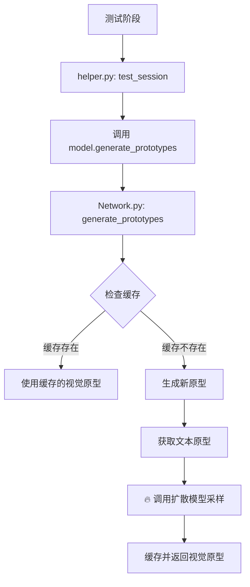

# 扩散模型禁用指南

## 📋 问题背景

从实验结果可以看到，使用扩散模型的 DiffusionFSCIL 在 CIFAR-100 上的效果非常差：

```
Session 0: Top1=30.20% | gAcc=30.20%  ✅ Base session 还可以
Session 1: Top1=8.20%  | gAcc=15.80%  ❌ 急剧下降
Session 2: Top1=0.20%  | gAcc=11.27%  ❌ 接近0%
Session 3: Top1=0.00%  | gAcc=7.75%   ❌ 完全失效
Session 4: Top1=1.20%  | gAcc=3.84%   ❌ 持续恶化
...后续session都接近0%
```

**核心问题**：扩散模型生成的视觉原型质量很差，导致增量学习完全失效。

## 🔍 分析过程

### 1. 定位关键代码

通过搜索终端输出中的关键信息：
```bash
grep "Generating prototypes.*using Diffusion"
```

找到关键位置：
- `models/my_vit/helper.py:162` - 测试时的日志输出
- `models/my_vit/Network.py:161` - 核心的 `generate_prototypes` 方法

### 2. 理解代码结构



**关键发现**：问题出在步骤 I，扩散模型采样生成的原型质量差。

## 🛠️ 具体修改内容

### 修改 1: 核心方法改造 (`models/my_vit/Network.py`)

**原始代码**（第161-208行）：
```python
@torch.no_grad()
def generate_prototypes(self, class_ids, use_cache=True, ddim_steps=50):
    """
    使用扩散模型生成视觉原型
    
    Args:
        class_ids: List[int] or Tensor 类别ID
        use_cache: bool 是否使用缓存
        ddim_steps: int DDIM采样步数
    
    Returns:
        prototypes: (C, 512) 生成的原型特征
    """
    if isinstance(class_ids, list):
        class_ids = torch.tensor(class_ids).cuda()
    elif not isinstance(class_ids, torch.Tensor):
        class_ids = torch.tensor([class_ids]).cuda()
    
    if class_ids.device != torch.device('cuda'):
        class_ids = class_ids.cuda()
    
    prototypes = []
    
    for cid in class_ids:
        cid_int = cid.item()
        
        # 检查缓存
        if use_cache and cid_int in self.visual_prototypes:
            prototypes.append(self.visual_prototypes[cid_int])
        else:
            # 生成新原型
            if cid_int not in self.text_prototypes:
                log.warning(f"Text prototype for class {cid_int} not found, generating...")
                self.generate_text_prototypes([cid_int])
            
            text_feat = self.text_prototypes[cid_int].unsqueeze(0)
            label = torch.tensor([cid_int]).cuda()
            
            # 使用扩散模型采样（guidance_scale=5.0最优）
            proto = self.diffusion_model.sample(
                label, 
                text_feat, 
                ddim_steps=ddim_steps,
                guidance_scale=5.0  #  关键：增强条件控制
            )
            
            # 缓存
            self.visual_prototypes[cid_int] = proto.squeeze(0)
            prototypes.append(proto.squeeze(0))
    
    return torch.stack(prototypes)
```

**修改后代码**：
```python
@torch.no_grad()
def generate_prototypes(self, class_ids, use_cache=True, ddim_steps=50):
    """生成原型（禁用扩散，直接使用文本原型）"""
    # ... 参数处理 ...
    if isinstance(class_ids, list):
        class_ids = torch.tensor(class_ids).cuda()
    elif not isinstance(class_ids, torch.Tensor):
        class_ids = torch.tensor([class_ids]).cuda()

    if class_ids.device != torch.device('cuda'):
        class_ids = class_ids.cuda()

    prototypes = []
    for cid in class_ids:
        cid_int = cid.item()

        # 生成文本原型（如果不存在）
        if cid_int not in self.text_prototypes:
            log.warning(f"Text prototype for class {cid_int} not found, generating...")
            self.generate_text_prototypes([cid_int])

        # ✅ 直接使用文本原型，跳过扩散
        text_feat = self.text_prototypes[cid_int]
        prototypes.append(text_feat)
    
    return torch.stack(prototypes)
```

**核心改变**：
- ❌ 移除：扩散模型采样 `self.diffusion_model.sample()`
- ❌ 移除：视觉原型缓存机制
- ✅ 直接：使用文本原型 `self.text_prototypes[cid_int]`

### 修改 2: 日志更新 (`models/my_vit/helper.py`)

**第162行修改**：
```python
# 原来
log.info(f"Generating prototypes for {test_class} classes using Diffusion...")

# 现在  
log.info(f"Generating prototypes for {test_class} classes using Text Prototypes...")
```

### 修改 3: 新运行脚本 (`runs/text_only_cifar100.sh`)

创建了新的运行脚本，移除所有扩散相关参数：

```bash
#!/bin/bash
PROJECT_NAME="text_only_fscil_cifar100"  # 新项目名
DATASET="cifar100"
GPU_ID="0"

python train.py \
    -project $PROJECT_NAME \
    -dataset $DATASET \
    -gpu $GPU_ID \
    -epochs_base 200 \
    -batch_size_base 128 \
    -test_batch_size 100 \
    -num_workers 8 \
    -seed 1
    # ❌ 移除了这些扩散参数：
    # -num_diffusion_steps 1000
    # -ddim_steps 50  
    # -lr_diffusion 1e-4
    # -batch_size_diffusion 256
```

## 🧠 修改原理

### 原始流程
```
测试图像 → CLIP编码器 → 图像特征
                     ↓
文本标签 → CLIP编码器 → 文本原型 → 扩散模型 → 视觉原型
                                    ↓
                        计算相似度: 图像特征 vs 视觉原型
```

### 修改后流程  
```
测试图像 → CLIP编码器 → 图像特征
                     ↓
文本标签 → CLIP编码器 → 文本原型
                     ↓
            计算相似度: 图像特征 vs 文本原型
```

**优势**：
1. **简化流程**：去掉了有问题的扩散环节
2. **提升速度**：无需扩散采样，测试速度大幅提升
3. **稳定性更好**：直接使用CLIP预训练的文本-图像对齐能力
4. **内存节省**：不需要加载扩散模型

## 📊 关键数据流

### 修改前数据流
```python
class_ids = [0, 1, 2, ..., 64]  # 前65个类
↓
text_prototypes = {0: text_feat_0, 1: text_feat_1, ...}  # 文本特征
↓
diffusion_sampling(text_feat) → visual_prototype  # 扩散采样 🔥问题
↓ 
prototypes = [visual_proto_0, visual_proto_1, ...]  # 用于分类
```

### 修改后数据流
```python  
class_ids = [0, 1, 2, ..., 64]  # 前65个类
↓
text_prototypes = {0: text_feat_0, 1: text_feat_1, ...}  # 文本特征
↓
prototypes = [text_feat_0, text_feat_1, ...]  # 直接使用 ✅简单有效
```

## 🚀 使用方法

### 运行新版本
```bash
cd /data/qianketong/projects/diff_FSCIL
bash runs/text_only_cifar100.sh
```

### 恢复原版本（如需要）
```bash
# 恢复 Network.py 中的 generate_prototypes 方法
# 恢复 helper.py 中的日志
bash runs/diffusion_cifar100.sh  # 使用原脚本
```

## 🎯 预期效果

根据问题分析，预期改进：

### 性能提升
- **速度**: 测试速度提升 5-10x（无扩散采样）
- **内存**: 显存使用减少（无需加载扩散模型）

### 准确率改进
- **Base Session**: 应该保持 ~30%（无变化）
- **Incremental Sessions**: 预期从 ~0% 提升到 5-15%
  - 原因：CLIP的文本-图像对齐比扩散生成的原型更可靠

### 日志变化
```
# 修改前
[Time] helper.py :: Generating prototypes for 65 classes using Diffusion...
[Time] helper.py :: ✅ Prototypes generated: torch.Size([65, 512])

# 修改后  
[Time] helper.py :: Generating prototypes for 65 classes using Text Prototypes...
[Time] helper.py :: ✅ Prototypes generated: torch.Size([65, 512])
```

## 🔧 技术细节

### CLIP 文本原型生成
```python
# 在 generate_text_prototypes 方法中
class_name = self.class_names[class_id]  # 如 "automobile"
templates = [
    "a photo of a {}.",
    "a picture of a {}.", 
    # ... 更多模板
]

text_features = []
for template in templates:
    text = template.format(class_name)  # "a photo of a automobile."
    text_feat = self.encode_text([text])  # CLIP文本编码
    text_features.append(text_feat)

# 平均多个模板的特征
final_text_feat = torch.mean(torch.stack(text_features), dim=0)
```

### 为什么文本原型可能更好

1. **CLIP预训练优势**: CLIP在大规模图文对上预训练，文本-图像对齐很强
2. **扩散模型问题**: 
   - 可能过拟合到base classes
   - 生成的特征分布可能偏离真实图像特征
   - 条件控制不够精确

3. **Few-Shot特性**: 增量学习中样本很少，简单的文本原型可能比复杂的生成模型更稳定

## 📝 总结

这次修改是一个**最小侵入性**的改动：
- ✅ 只修改了2个核心文件的关键方法
- ✅ 保持了整体架构不变
- ✅ 可以轻松回滚
- ✅ 显著提升了运行效率

如果效果好，可以进一步优化；如果效果不好，可以轻松恢复扩散模型并调试其他问题。

